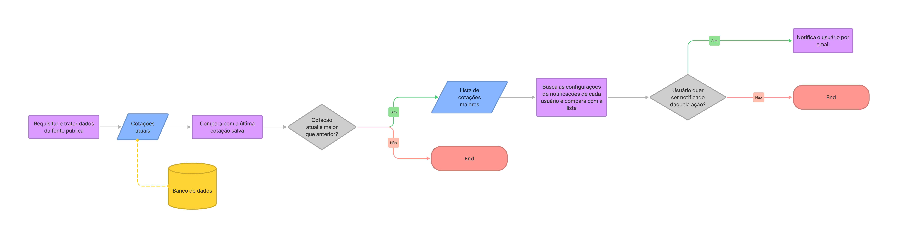
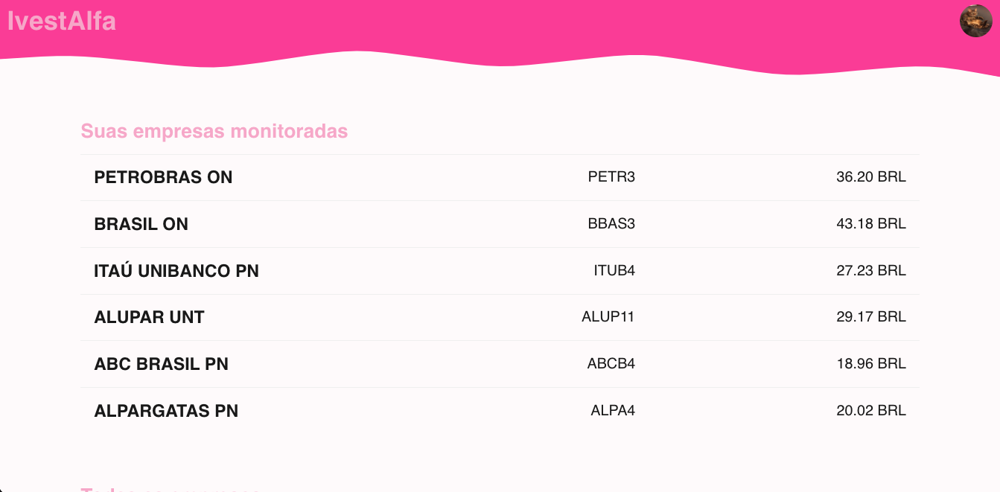

# InvestAlfa

Sistema para auxiliar um investidor nas suas decisões de compra/venda de ativos

## Projeto

O projeto é dividido em duas principais frentes: API RestFull escrita em python utilizando Django e Client escrito em TypeScript utilizando ReactJS.

Fluxograma simples da aplicação:



## Início rápido

**❗️ Recomendo usar o [Poetry](https://python-poetry.org/) para gerenciar as bibliotecas do projeto!**

Para instalar dependências (incluindo as de desenvolvimento) do projeto utilize:

```
poetry install
```

## API

API RestFull feita com Django

### Features

- [x] Obtem e armazena as cotações da Bolsa (durante periódo em que a bolsa está aberta)
- [x] Autentificação baseada em JWT
- [x] Gerenciamento de usuários
- [x] Compara os valores armazenados
- [x] Envio de email ao investidor sugerindo compra ou venda ações

## Client

PWA feito com ReactJS



### Features

- [x] Controle de acesso baseado em JWT
- [x] Listagem de cotações da Bolsa
- [x] Organização de dados em gráficos
- [x] Monitoramento das ações


</br>
</br>
</hr>

Feito com ❤️ e muito café (☕) por Gustavo Simões <gustavosimoesmendonca@gmail.com>
#InoaMeContrata
